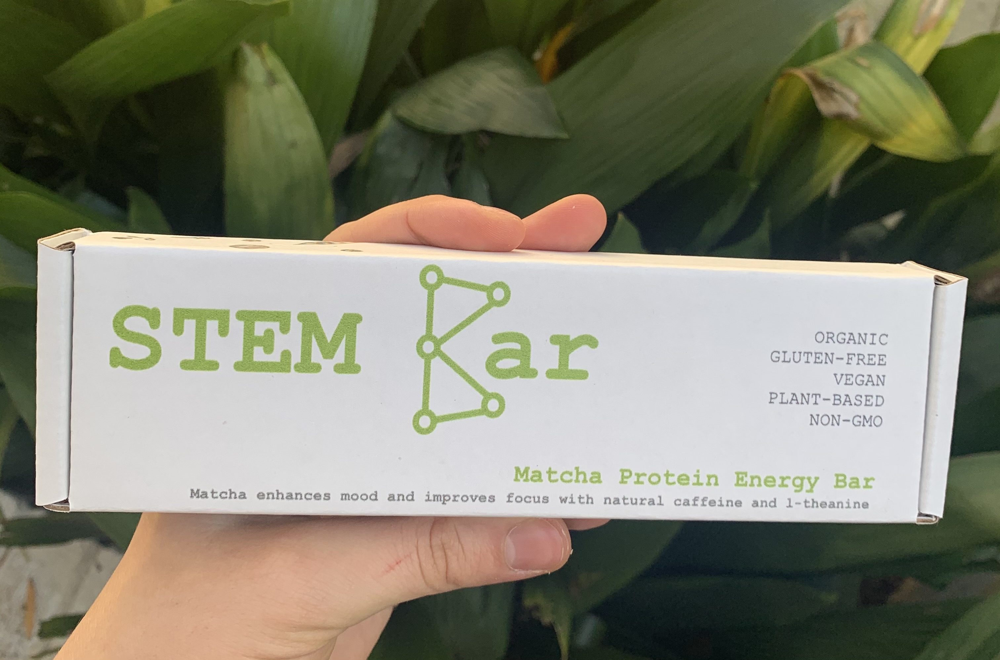

## Portfolio

---

### Technical Projects 

[Scrabble Game](https://bytes.usc.edu/cs104/homework/hw5/)

---
[GuacOn - Meal Planning Application](sample_page.md)

---
[CSCI 104: Data Structures and OOP](https://bytes.usc.edu/cs104/)

---

### Entrepreneurship and Organization Projects

- [Director of The Crucible](The_Crucible.md)

---
- [STEM Bar Founder](https://stembar.yolasite.com/)

---
- [Project Impact Website](https://projectimpact.world/groups/)

---

---

Page template forked from <a href="https://github.com/evanca/quick-portfolio">evanca</a>

<!-- Remove above link if you don't want to attibute -->
